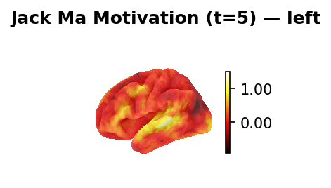
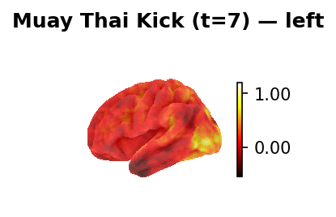
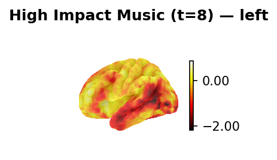
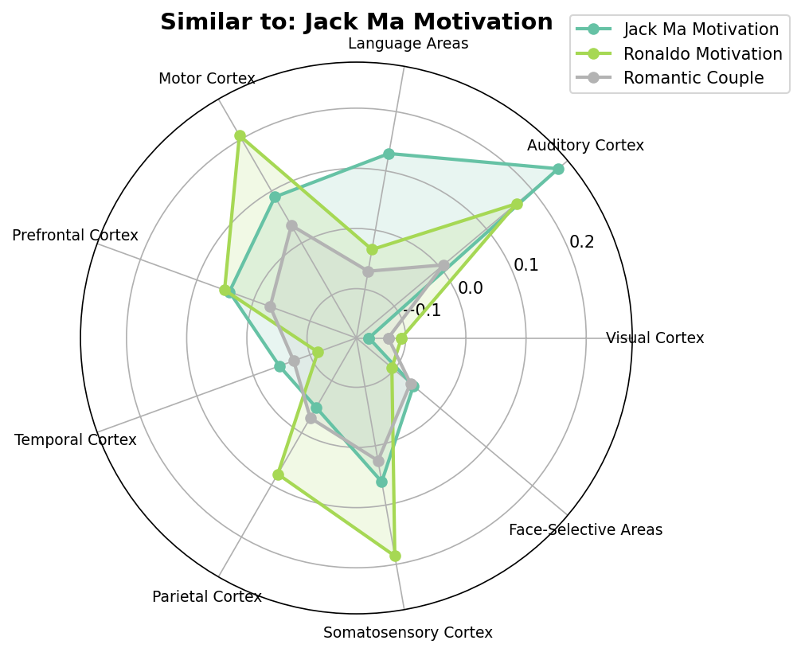
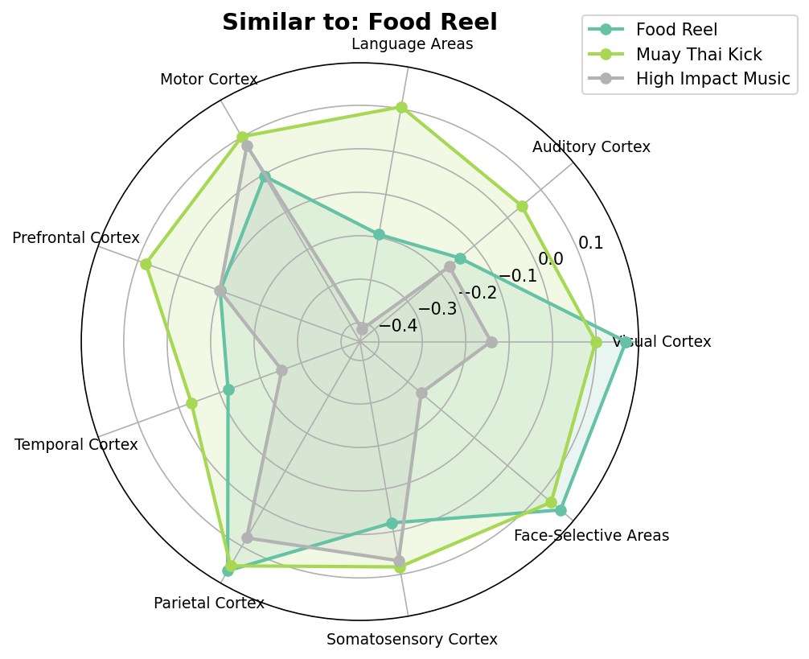
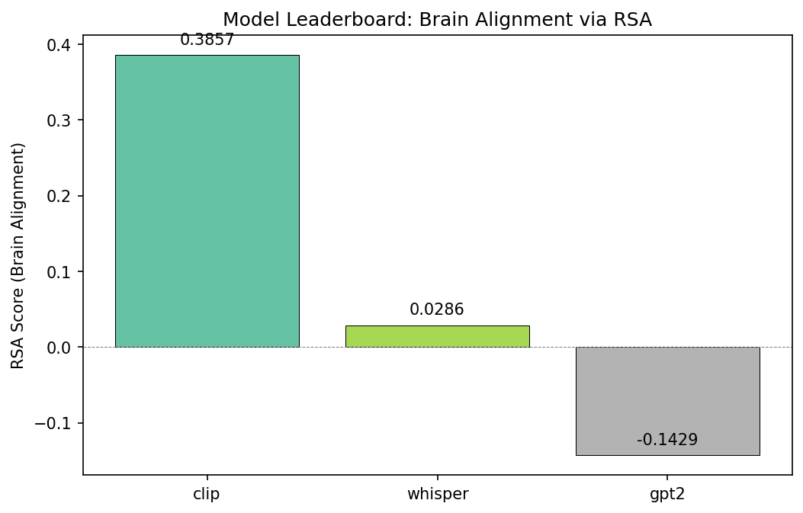

<div align="center">

# TRIBE v2 + NeuroLens

**A Foundation Model of Vision, Audition, and Language for In-Silico Neuroscience**

[](https://colab.research.google.com/github/facebookresearch/tribev2/blob/main/tribe_demo.ipynb)
[](https://creativecommons.org/licenses/by-nc/4.0/)
[](https://www.python.org/downloads/)
[](#neurolens)

📄 [Paper](https://ai.meta.com/research/publications/a-foundation-model-of-vision-audition-and-language-for-in-silico-neuroscience/) ▶️ [Demo](https://aidemos.atmeta.com/tribev2/) | 🤗 [Weights](https://huggingface.co/facebook/tribev2)

</div>

---

## NeuroLens — Interactive Neuroscience Playground

> **My contribution**: An interactive analysis module built on top of Meta AI's TRIBE v2 brain encoding model. NeuroLens enables exploration of brain predictions through three modules — Predict, Match, and Eval — with no GPU required for interactive use.

<div align="center">





*Left: Speech stimulus (Jack Ma) — auditory cortex hotspot. Center: Action stimulus (Muay Thai) — broad cortical engagement. Right: Music stimulus — deep language suppression.*

</div>

### Key Findings from 6 Video Stimuli

| Finding | Value | Significance |
|---------|-------|-------------|
| **CLIP brain alignment** | RSA = 0.386 (38.6%) | 13x better than Whisper, anti-correlated with GPT-2 |
| **Speech neural clustering** | Similarity = 0.801 | Jack Ma & Ronaldo form the tightest pair in the dataset |
| **Music suppresses language** | Language Areas = -0.414 | Most extreme single ROI value — active neural competition |
| **Same category, orthogonal brains** | Similarity = 0.001 | Muay Thai vs Romantic Couple (both "Silence + Visuals") |
| **Motor Cortex universality** | Grand mean = +0.084 | Only ROI positive across all stimuli (embodied simulation) |

### The Three Modules

**1. PREDICT** — Brain surface visualization at any timepoint with ROI summaries

| Stimulus | Category | Top ROI | Bottom ROI | Profile |
|----------|----------|---------|-----------|---------|
| Jack Ma Motivation | Speech | Auditory Cortex (+0.256) | Visual Cortex (-0.161) | Auditory-linguistic |
| Muay Thai Kick | Silence + Visuals | Parietal Cortex (+0.152) | Temporal (-0.031) | Broadly diffuse |
| Ronaldo Motivation | Speech | Motor Cortex (+0.207) | Temporal (-0.114) | Motor-somatosensory |
| Romantic Couple | Silence + Visuals | Motor Cortex (+0.034) | Visual (-0.129) | Globally suppressed |
| Food Reel | Silence + Visuals | Visual Cortex (+0.169) | Language (-0.193) | Pure visual-spatial |
| High Impact Music | Music | Parietal Cortex (+0.078) | Language (-0.414) | Extreme suppression |

**2. MATCH** — Neural similarity and contrast analysis

<div align="center">



*Left: Speech stimulus radar (Auditory/Language dominant). Right: Visual stimulus radar (Visual/Parietal dominant) — nearly mirror images.*
</div>

**Neural Similarity Matrix:**

| | Jack Ma | Muay Thai | Ronaldo | Romantic | Food Reel | Music |
|---|---------|-----------|---------|----------|-----------|-------|
| **Jack Ma** | 1.000 | 0.161 | **0.801** | 0.589 | — | 0.090 |
| **Muay Thai** | 0.161 | 1.000 | 0.294 | **0.001** | **0.554** | — |
| **Ronaldo** | **0.801** | 0.294 | 1.000 | 0.560 | 0.203 | 0.492 |
| **Romantic** | 0.589 | **0.001** | 0.560 | 1.000 | 0.304 | 0.507 |
| **Food Reel** | — | **0.554** | 0.203 | 0.304 | 1.000 | 0.313 |
| **Music** | 0.090 | — | 0.492 | 0.507 | 0.313 | 1.000 |

**3. EVAL** — AI model vs brain alignment using RSA

<div align="center">


*CLIP (visual) dominates. Whisper (audio) is marginal. GPT-2 (text) anti-correlates — linguistic similarity contradicts perceptual brain organization.*
</div>

| Rank | Model | Input | RSA Score | Brain Alignment |
|------|-------|-------|-----------|----------------|
| 1 | **CLIP** (ViT-B-32) | Middle video frame | **+0.386** | **38.6%** |
| 2 | **Whisper** (base) | Full audio track | +0.029 | 2.9% |
| 3 | **GPT-2** | Stimulus title text | -0.143 | 0% (anti-correlated) |

### Cross-Module Synthesis

Three major principles emerged from the analysis:

1. **Visual Dominance** — Brain representational structure is primarily organized around visual features, even when audio/speech is present. CLIP (single frame) outperforms Whisper (full audio) by 13x.

2. **Language Suppression by Music** — Music at -0.414 Language Areas is the most extreme value in the dataset. Non-linguistic auditory input actively inhibits language networks, with implications for music therapy and cognitive load research.

3. **Embodied Simulation** — Motor Cortex is the only ROI with a positive grand mean across all stimuli. Video perception consistently engages motor circuits through action observation and mirror neuron mechanisms.

### Architecture

```
neurolens/
├── cache.py        # CacheManager — loads pre-computed predictions
├── predict.py      # Brain prediction loading, slicing, ROI extraction
├── match.py        # Neural similarity search and region contrasting
├── eval.py         # RSA-based model-brain alignment scoring
├── viz.py          # Brain surface plots and radar charts (nilearn)
├── roi.py          # HCP MMP1.0 atlas ROI group utilities
├── stimulus.py     # Stimulus metadata loading and filtering
└── generate_all_results.py  # Batch analysis across all parameters
```

**Design**: Cache-based architecture separates GPU-heavy brain prediction (Colab) from CPU-only interactive exploration (local). 31 tests across 8 files, 100% passing.

> **Full detailed findings**: [NEUROLENS_FINDINGS_REPORT.md](neurolens_results/NEUROLENS_FINDINGS_REPORT.md)

---

*TRIBE v2 is developed by Meta AI. NeuroLens is an independent contribution by [Ansuman SS Bhujabala](https://github.com/Ansumanbhujabal). The underlying brain encoding model and all original code remain the work of the TRIBE v2 authors.*

```bibtex
@article{dAscoli2026TribeV2,
  title={A foundation model of vision, audition, and language for in-silico neuroscience},
  author={d'Ascoli, St{\'e}phane and Rapin, J{\'e}r{\'e}my and Benchetrit, Yohann and Brookes, Teon and Begany, Katelyn and Raugel, Jos{\'e}phine and Banville, Hubert and King, Jean-R{\'e}mi},
  year={2026}
}
```

---

# TRIBE v2 — Original README

TRIBE v2 is a deep multimodal brain encoding model that predicts fMRI brain responses to naturalistic stimuli (video, audio, text). It combines state-of-the-art text, audio and video models into a unified Transformer architecture that maps multimodal representations onto the cortical surface.

## Quick start

Load a pretrained model from HuggingFace and predict brain responses to a video:

```python
from tribev2 import TribeModel

model = TribeModel.from_pretrained("facebook/tribev2", cache_folder="./cache")

df = model.get_events_dataframe(video_path="path/to/video.mp4")
preds, segments = model.predict(events=df)
print(preds.shape)  # (n_timesteps, n_vertices)
```

Predictions are for the "average" subject (see paper for details) and live on the **fsaverage5** cortical mesh (~20k vertices).
They are offset by 5 seconds in the past, in order to compensate for the hemodynamic lag.

You can also pass `text_path` or `audio_path` to `model.get_events_dataframe` — text is automatically converted to speech and transcribed to obtain word-level timings.

For a full walkthrough with brain visualizations, see the [Colab demo notebook](https://colab.research.google.com/github/facebookresearch/tribev2/blob/main/tribe_demo.ipynb).

## Installation

**Basic** (inference only):
```bash
pip install -e .
```

**With brain visualization**:
```bash
pip install -e ".[plotting]"
```

**With training dependencies** (PyTorch Lightning, W&B, etc.):
```bash
pip install -e ".[training]"
```

## Training a model from scratch

### 1. Set environment variables

Configure data/output paths and Slurm partition (or edit `tribev2/grids/defaults.py` directly):

```bash
export DATAPATH="/path/to/studies"
export SAVEPATH="/path/to/output"
```


### 2. Run training

**Local test run:**
```bash
python -m tribev2.grids.test_run
```

**Grid search on Slurm:**
```bash
python -m tribev2.grids.run_cortical
python -m tribev2.grids.run_subcortical
```

## Project structure

```
tribev2/
├── main.py              # Experiment pipeline: Data, TribeExperiment
├── model.py             # FmriEncoder: Transformer-based multimodal→fMRI model
├── pl_module.py         # PyTorch Lightning training module
├── demo_utils.py        # TribeModel and helpers for inference from text/audio/video
├── eventstransforms.py  # Custom event transforms (word extraction, chunking, …)
├── utils.py             # Multi-study loading, splitting, subject weighting
├── utils_fmri.py        # Surface projection (MNI / fsaverage) and ROI analysis
├── grids/
│   ├── defaults.py      # Full default experiment configuration
│   └── test_run.py      # Quick local test entry point
├── plotting/            # Brain visualization (PyVista & Nilearn backends)
└── studies/             # Dataset definitions (Algonauts2025, Lahner2024, …)
```

## Contributing to open science

If you use this software, please share your results with the broader research community using the following citation:

```bibtex
@article{dAscoli2026TribeV2,
  title={A foundation model of vision, audition, and language for in-silico neuroscience},
  author={d'Ascoli, St{\'e}phane and Rapin, J{\'e}r{\'e}my and Benchetrit, Yohann and Brookes, Teon and Begany, Katelyn and Raugel, Jos{\'e}phine and Banville, Hubert and King, Jean-R{\'e}mi},
  year={2026}
}
```

## License

This project is licensed under CC-BY-NC-4.0. See [LICENSE](LICENSE) for details.

## Contributing

See [CONTRIBUTING.md](CONTRIBUTING.md) for how to get involved.

---

## More NeuroLens Resources

- [Full Findings Report](neurolens_results/NEUROLENS_FINDINGS_REPORT.md) — Comprehensive 300-line analysis with cross-module synthesis
- [Getting Started Guide](docs/GETTING_STARTED.md) — Setup, cache generation, and running the interactive notebook
- [Interactive Notebook](neurolens.ipynb) — Widget-based exploration with brain plots, radar charts, and leaderboard
